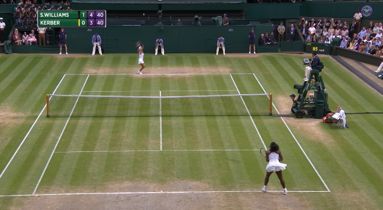

:sparkles: [one of my 100 projects](https://github.com/dotsara/100-projects) :sparkles:

# Score bugs

I watch a _lot_ of sportsball on tv. And few+ years ago, [I started cataloging](http://tumbly.dotsara.com/tagged/football) the different [score bugs](https://en.wikipedia.org/wiki/Score_bug)--the on-screen graphic giving you game details--for football games. Mostly because at the time some of them were _rubbish_ (I'm glaring at you, baby NFL Network).

It won't surprise you to know that once I paid closer attention to score bugs in football, I paid closer attention to them in every other sport I watch, too. Y'all, some of them are real bad. But! some of them are wonderfully thoughful, too. Par example: the bug for Wimbledon matches. :heart_eyes:

You know: who's playing, who's serving, the current game's score, the outcome of previous sets (or games if you're in the first set).

It's so good!

My goal is to fiddle around with how _I_ think the best score bug should look for `#{sport}`. 

